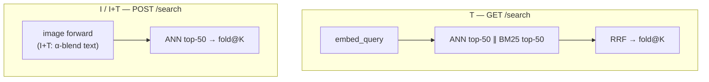

# Architecture

Local multimodal index: SwiftUI shell + Python backend (FastAPI, MLX, LanceDB). All inference and storage stay on-device; the backend binds `127.0.0.1` on a random port.

```
Swift (SwiftUI)                         Python (FastAPI + MLX)
───────────────                         ──────────────────────
Pulsar        ⌥ Space                  GET/POST /search · /index
Chronosphere  ⌥ Space×2                /healthz · /settings · /model · /nebula
Settings                                │
FSEvents (1.5 s debounce)               JobQueue → embed/executor.py
         │                                        → jina v5 omni (~1.8 GB)
         │  HTTP loopback
         └──────────────────────────►  LanceDB (vectors + FTS)
```

## Data directory

Default root: `~/Library/Application Support/Rubick/` (override with `RUBICK_DATA_DIR`; dev builds often use `RubickDev`).

| Path | Contents |
|------|----------|
| `models/` | Embedding weights (HuggingFace cache) |
| `lancedb/` | Vector index + row metadata + FTS |
| `thumbnails/` | 128 px short-edge WebP previews |
| `nebula_map.json` | UMAP 3D coordinates + HDBSCAN clusters |
| `watched_folders.json` | Watched folder list |
| `settings.json` | Runtime knobs (chunking, etc.) |
| `logs/` | Rotating ingest logs |

## Embedding model

| | |
|---|---|
| Weights | `jina-embeddings-v5-omni-nano-retrieval-mlx` |
| Runtime | Pure MLX on Apple Silicon (Metal) |
| Dimension | 768-d, L2-normalized |

Image/video preprocessing is hand-rolled in `embed/preprocessing.py` (no `AutoProcessor`).

## Runtime dependencies

**Production:** `mlx`, `tokenizers`, `pillow`, `numpy`, `av`, LanceDB stack.

**Omitted from prod / DMG:** `torch`, `torchvision`, `transformers` — not needed at runtime.

**Dev-only** (`pip install -e ".[dev]"`): `torch` + `transformers` for `test_preprocessing_parity.py`.

## Process model

One Python process, one loaded model. A priority queue schedules work: **HIGH** = search embeds, **LOW** = ingest. Metal cache capped at 2 GiB. Ingest pause/resume via asyncio events.

## Retrieval

Search is chunk-indexed, doc-presented. Ingest granularity: **text** → N chunks per file; **image / video** → one row each (`chunk_idx=0`).

| Input | API | Query vector | Retrieve |
|-------|-----|--------------|----------|
| **T** (text) | `GET /search?q&limit=K` | `embed_query(q)` — text forward, `"Query: "` prefix | ANN ∥ BM25 → RRF → fold@K |
| **I** (image) | `POST /search` — image, empty `q` | image forward only | ANN top-50 → fold@K |
| **I+T** | `POST /search` — `q` + image, `text_weight` α | `L2_norm(α·text + (1−α)·image)` | ANN top-50 → fold@K |

**T** is hybrid (semantic + lexical). **I / I+T** are vector-only — attached images query by visual similarity, not BM25 filename matches. On **I+T**, text steers `qvec` via α-blend; it does not enable the BM25 leg.



### Tunables

| Knob | Default | Range | Scope |
|------|---------|-------|-------|
| **K** (`limit`) | 20 | 1–50 | Docs returned after fold; capped by recall (≤50 per ranker); Pulsar reads `search_top_k` |
| **α** (`text_weight`) | 0.5 | 0–1 | I+T only; ignored when `q` is empty |
| Recall | 50 | fixed | Chunks per ranker before fusion (`recall=50`) |
| RRF **k** | 60 | fixed | T only |

**fold@K** — collapse chunk hits by `doc_id`, keep the best chunk per file, return up to K docs. Meaningful dedup on **T** (multi-chunk text); on **I / I+T** each image/video is already one chunk, so fold mainly caps the result count.

Optional LanceDB filters (all paths): `modality`, `path_prefix`, `mtime_after` / `mtime_before`; rows with `modality='rejected'` hidden by default.

## Chronosphere

Backend computes a 3D UMAP layout (cosine metric) and HDBSCAN clusters; result cached in `nebula_map.json`. Frontend renders the map in a WKWebView (Three.js). Map recomputes after ingest completes.

## Supported scope

| In | Out |
|----|-----|
| `.md` / `.txt` / `.org` | PDF, code files, audio |
| Images (10 formats: JPEG, PNG, WebP, HEIC, GIF, BMP, TIFF, …) | Manual tags |
| Video ≤ 2 min (`.mp4`, `.mov`, `.m4v`, `.webm`, `.mkv`, `.avi`) | Long video (> 2 min) |
| | Cloud APIs / uplink |
