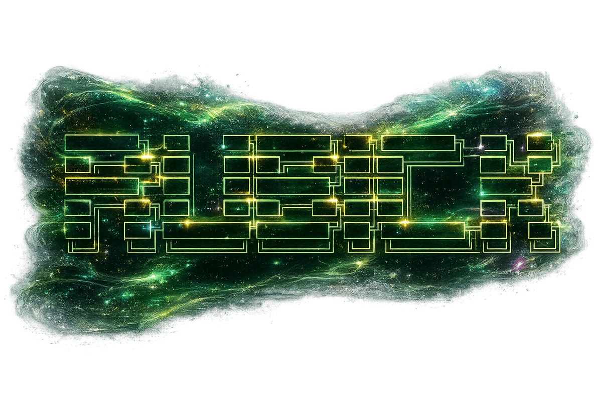
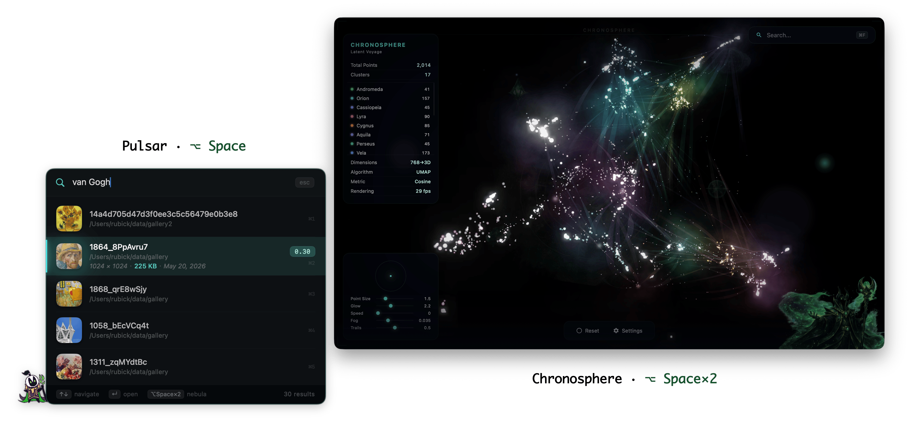

<p align="center">
  
</p>

<p align="center">
  <code>// LOCAL · MULTIMODAL · INDEX</code><br>
  <sub><code>pure·mlx</code> · <code>zero·uplink</code> · <code>apple·silicon</code></sub>
</p>

<p align="center">
  <a href="LICENSE"></a>
  
  
  
  
</p>

---

### `// ORIGIN.log`

```
[RUBICK] Grand Magus doctrine: do not invent — recall.
         Every duel leaves signal in the air; pull the cast back when it matters.
         >> The Grand Magus doesn't forget.

[MAP]    Your FS is a graveyard of half-cast artifacts:
         .md .txt .org · images · video ≤2 min
         → one joint embedding manifold (text · image · video)
         → hybrid retrieve: ANN_top50 ∪ BM25_top50 → RRF(k=60) → fold@K

[MODES]  ⌥Space      pulsar        // Enter-to-search, 5-up panel
         ⌥Space×2    chronosphere  // UMAP₃ + HDBSCAN, WKWebView sky
         ⌘V          fused_query   // T+I blend, multipart POST

[RUNTIME] pure MLX inference — jina-v5-omni-mlx weights only
          preprocess: PIL + numpy (hand-rolled; no AutoProcessor)
          omit:     -torch -torchvision -transformers   # unnecessary @ runtime
          dev opt:  torch+transformers only for parity tests (not in .app)

[NET]    bind 127.0.0.1:RANDOM · weights via HF once · no telemetry
[DATA]   ~/Library/Application Support/Rubick/  (override: RUBICK_DATA_DIR)
```

---

### `// TOPOLOGY`

```
┌─────────────┐   HTTP/loopback    ┌──────────────────┐
│  SwiftUI    │ ─────────────────► │ FastAPI + MLX    │
│  Pulsar     │                    │ JobQueue         │
│  Chronosph. │ ◄───────────────── │ embed/executor   │
└─────────────┘                    └────────┬─────────┘
                                            │
                                   ┌────────▼─────────┐
                                   │ LanceDB          │
                                   │  · vector ANN    │
                                   │  · FTS (BM25)    │
                                   │  · thumbnails/   │
                                   └──────────────────┘
```

---

### `// INTERFACE`

<p align="center">
  
</p>

---

### `// WALKTHROUGH`

Prefer seeing Rubick in motion? One complete walkthrough, split into four parts:

| part | mode | covers |
|:-----|:-----|:-------|
| 1 | **Pulsar** | real-time hybrid search (`⌥ Space`) |
| 2 | **Chronosphere** | 3D semantic map (`⌥ Space` ×2) |
| 3 | **Multilingual search** | cross-language retrieval |
| 4 | **Fused query** | text + image blend (`⌘ V`) |

**Watch the full walkthrough** ·
<a href="https://youtu.be/saHtgW-BOWM"></a>
<a href="https://www.zhihu.com/pin/2040844512491221869"></a>

---

### `// STACK`

| layer | deps |
|:------|:-----|
| embed | `mlx` · `tokenizers` · `huggingface_hub` (download only) |
| vision | `pillow` · `pillow-heif` · `numpy` · `av` (video frames) |
| store | `lancedb` · `umap-learn` · `hdbscan` |
| ⊘ omit | ~~`torch`~~ · ~~`torchvision`~~ · ~~`transformers`~~ — don't need these to run |

`.app` backend-runtime == prod deps (no ~~torch~~ stack) → smaller Metal footprint on arm64.

---

### `// BINDINGS`

| input | action |
|:------|:-------|
| `⌥ Space` | open **Pulsar** — ANN+BM25→RRF, **Enter** fires query |
| `⌥ Space` ×2 | open **Chronosphere** — 3D semantic map |
| `⌘ V` | image chip in search bar — fused T+I vector |
| `⌘ ,` | settings — watch dirs, chunking, model cache |

---

### `// HOST_SPEC`

| key | value |
|:----|:------|
| `platform` | macOS 13+ · **arm64 only** (M1–M4) |
| `ram` | 16G min · 32G rec |
| `uplink` | HuggingFace download @ first run · otherwise **offline** |

---

### `// BUILD`

```bash
# --- backend ---
cd backend && uv venv --python 3.12 && source .venv/bin/activate
uv pip install -e ".[dev]"

# --- frontend ---
brew install --cask tuist    # once
tuist generate
xcodebuild -workspace Rubick.xcworkspace -scheme Rubick \
  -configuration Debug -destination 'platform=macOS,arch=arm64' \
  build CODE_SIGNING_ALLOWED=NO

# --- run (scratch datadir) ---
APP=$(find ~/Library/Developer/Xcode/DerivedData/Rubick-*/Build/Products/Debug \
        -maxdepth 2 -name 'Rubick.app' | head -1)
RUBICK_DATA_DIR="$HOME/Library/Application Support/RubickDev" open -a "$APP"
```

`RubickDev` keeps production `~/Library/Application Support/Rubick/` clean.  
Gates: `pytest` · `ruff check src tests` · see [CONTRIBUTING.md](CONTRIBUTING.md).

---

### `// RELEASE`

```bash
./scripts/build_dmg.sh              # embed backend-runtime → .app
./scripts/notarize.sh <path.dmg>    # optional · needs Developer ID
```

Prebuilt DMGs live on the [Releases](https://github.com/BIGBALLON/rubickkkkkk/releases) page — unsigned, unnotarized. First launch needs `xattr -dr com.apple.quarantine /Applications/Rubick.app` or right-click → Open to bypass Gatekeeper.

---

### `// LICENSE`

MIT on the **source**: clone it, fork it, rip it apart, glue it back wrong — hack away; keep the license header.  
Model **weights** stay CC BY-NC 4.0. Shipping the full stack for money needs a separate license from Jina — MIT does not cover the downloaded weights.
